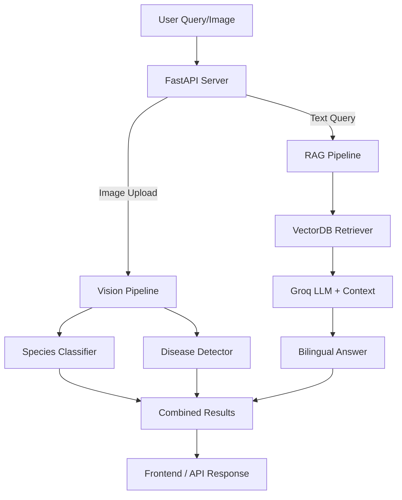

# 🐠 MeenaSetu AI: Intelligent Fish Health & Aquaculture Assistant

<div align="center">

### *Ask About Fish Health. Get AI-Powered Answers.*

**Transform fish images and aquaculture questions into actionable insights with a production-ready RAG + Computer Vision stack.**

[](https://www.python.org)
[](https://fastapi.tiangolo.com)
[](https://pytorch.org)
[](https://keras.io)
[](LICENSE)

</div>

---

MeenaSetu AI brings together **computer vision for fish species classification**, **disease detection models**, and **modern LLM-powered retrieval** to help fish farmers, researchers, and enthusiasts. It provides a conversational interface where you can:

- Upload fish images for automatic species identification 🐟
- Detect diseases from fish photos with confidence scoring 🏥
- Ask natural language questions about aquaculture best practices 💬
- Get bilingual answers (Hindi-English) tailored to Indian fish farming contexts 🇮🇳

---

## ✨ Key Features

### **Intelligent Fish Analysis**
- **Multi-Model Species Classification**: Ensemble of 3 EfficientNet models for reliable identification
- **Disease Detection Pipeline**: Keras-based model detecting 7 common fish diseases
- **Confidence Transparency**: Clear confidence scoring for all predictions (High/Medium/Low)
- **Image Processing**: Automatic preprocessing and feature extraction

### **Conversational Aquaculture Assistant**
- **RAG-Powered Q&A**: Retrieval-Augmented Generation with 43,515+ indexed documents
- **Bilingual Intelligence**: Natural Hindi-English code-mixing in responses
- **Context-Aware Answers**: Grounded in specific aquaculture knowledge base
- **Conversation Memory**: Remembers previous questions for follow-ups

### **Production-Ready Infrastructure**
- **FastAPI Backend**: High-performance REST API with automatic documentation
- **Vector Database**: Chroma DB with semantic search capabilities
- **Modular Architecture**: Separated components for easy maintenance
- **Comprehensive Logging**: Detailed logs for debugging and monitoring

### **Safety & Practicality**
- **Preventive-Focused**: Emphasizes prevention over medication
- **Expert Referral**: Always suggests consulting fisheries officers for serious cases
- **No Dosage Advice**: Safety-first approach avoids specific medication recommendations
- **Uncertainty Acknowledgement**: Clearly states when confidence is low

---

## 🏗️ Architecture Overview

MeenaSetu combines computer vision, natural language processing, and knowledge retrieval:



---

## 🚀 Why MeenaSetu is Different

- **Image & Text Duality**: Combine vision models and LLM QA seamlessly
- **Bilingual & Code-Mixed AI**: Realistic, locally adapted answers for Indian aquaculture
- **Safety Built-In**: No risky or dosage-specific advice, always encourages expert involvement
- **Production Ready**: Robust backend, vector search, and logging for scale and reliability

---

## 🧩 Example Usage

- **Image-Based**: “Upload a fish photo to identify the species.”
- **Disease Detection**: “Is there a visible problem on this fish? Is it a disease?”
- **Text Q&A**: “What is the best water temperature for Rohu fry?”  
- **Mixed**: “Upload and ask: क्या इसमें कोई बीमारी है?”

---

## 🛠️ Quick Start

**Prerequisites**  
- Python 3.9+  
- Node.js 14+ (for optional frontend)  
- ChromaDB / SQLite for vector DB  
- git  

```bash
git clone https://github.com/Coderamrish/Meenasetu.git
cd Meenasetu

python -m venv venv
source venv/bin/activate        # Windows: venv\Scripts\activate
pip install -r requirements.txt

cp .env.example .env            # Edit with your keys
# Preload models and data
python scripts/download_models.py
python scripts/ingest_documents.py

uvicorn backend.main:app --reload --port 8000
```

**Frontend (optional)**
```bash
cd frontend-react
npm install
npm start
```

**API Testing**
```bash
curl -X POST "http://localhost:8000/api/predict" -F image=@/path/to/fish.jpg
```

---

## 🧪 Developer & API Notes

- **REST endpoints (FastAPI)**: Upload, predict, ask, stream
- **WebSocket**: Real-time conversational UI support (planned)
- **Embeddings**: Configurable with HuggingFace/OpenAI
- **Vector Store Options**: ChromaDB (default), FAISS (optional)

**Key .env variables**
```
OPENAI_API_KEY=
HUGGINGFACE_API_KEY=
DATABASE_URL=sqlite:///meenasetu.db
VECTOR_BACKEND=chroma
```

---

## ⏭️ Roadmap

- Expand disease classification coverage to more conditions
- Add voice-to-text and speech output for accessibility
- Regional language fine-tuning
- Incidence/alert mapping and anomaly tracking
- Mobile app & push notification support

---

## 🤝 Contributing

Your contributions are welcome:  
1. Fork the repo  
2. Make a feature branch  
3. Add tests/documentation  
4. Open a PR describing your change  

See [`CONTRIBUTING.md`](CONTRIBUTING.md) for community guidelines.

---

## 📚 Credits

- Indian Council of Agricultural Research for domain references
- ChromaDB, HuggingFace, ONNX, Groq, OpenAI
- Fish health researchers, extension officers & open source contributors

---

## 📄 License

MIT License. See [LICENSE](LICENSE).

---

## 📬 Contact & Support

- [Issues](https://github.com/Coderamrish/Meenasetu/issues)
- Email: tiwariambrish81@gmail.com

---

*For thriving aquaculture. Made for India's fish farmers, researchers, and enthusiasts.*
